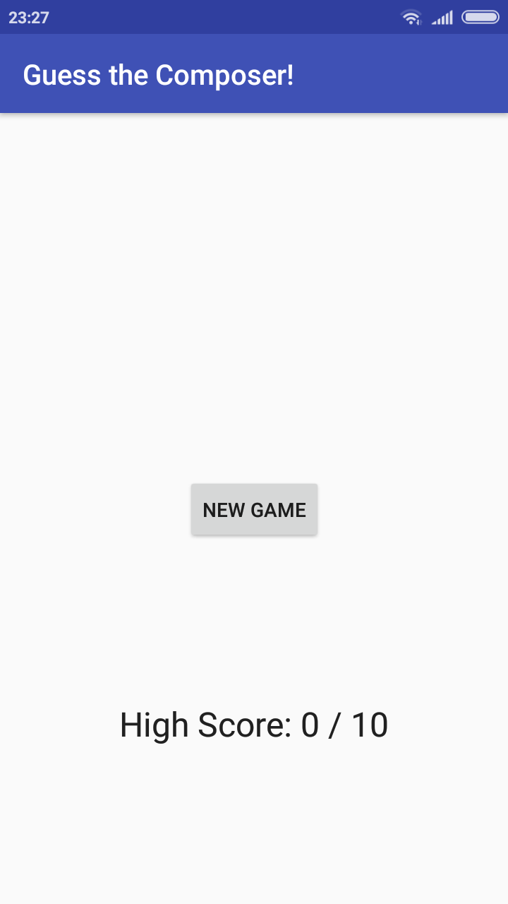
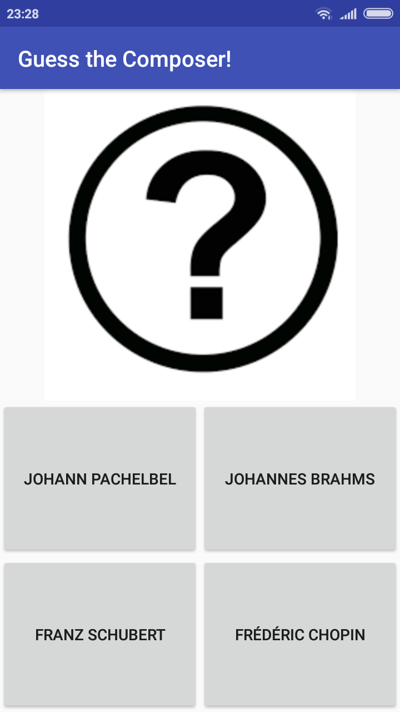

# Android-ClassicalMusicQuiz-App

This app plays a classic music audio and the users have to guess correct composer from multiple options.

This is the toy app for the Media Playback lesson of the [Advanced Android App Development course on Udacity](https://www.udacity.com/course/advanced-android-app-development--ud855).

## Screenshots
 

## Demo

## Features
* The app keeps track of user's highest score as well as the latest score they have managed to achieve in the current session.
* The app keeps playing music even the app is in the background. A notification is displayed that can play or pause and change music from   outside the app.

## Technical Details
* Makes use of [**ExoPlayer**](https://github.com/google/ExoPlayer) for playing the music.
* **SharedPreferences** are used for saving the score of user.
